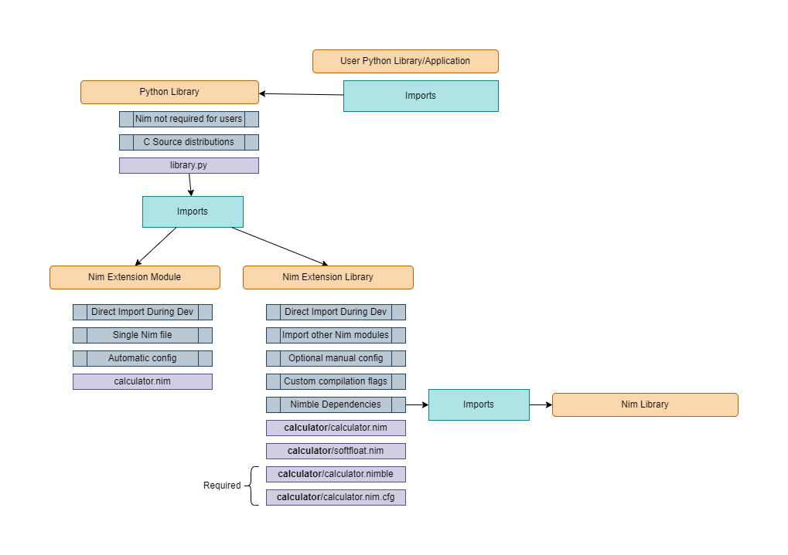

<p align="center">
    
</p>

&nbsp;&nbsp;&nbsp;&nbsp;&nbsp;&nbsp;&nbsp;&nbsp;&nbsp;&nbsp;&nbsp;&nbsp;&nbsp;&nbsp;&nbsp;


# Nimporter

> *Directly import [Nim](<https://nim-lang.org/>) extensions for Python and
seamlessly package them for distribution in **1 line of code.***

<p align="center">
    
</p>

<p align="center">
    
</p>

## 🍱 Benefits

* **🐆 Performance**: Nim compiles to C

* **🚚 Distribution**: Packaging Nimporter libraries is the primary use case

* **📦 Invisible**: End users do not need to install Nim for source or binary
    distributions

* **♻️ Ecosystem**: Leverage [Python](https://pypi.org/) libraries for breadth
    and [Nim](https://nimble.directory/) libraries for performance.

* **🧣 Seamless**: Integration with existing Nim code uses the
    [Nimpy](https://github.com/yglukhov/nimpy) library.

* **🎈 Simple**: Nimporter barely has a user interface at all

## 🐣 Installation

```bash
# 🐍 From Pypi:
$ pip install nimporter

# ⚙️ From GitHub:
$ pip install git+https://github.com/Pebaz/Nimporter
```

**Library Author Dependencies:**

 1. [Nim Compiler](<https://nim-lang.org/install.html>) (for compiling Nim
    source files)
 2. [Nimpy library](https://github.com/yglukhov/nimpy) (installed automatically
    if `nimporter init lib` is used)
 3. [Nimporter library](https://github.com/Pebaz/nimporter) (distributed
    libraries will need access to Nimporter).

Nimporter can work seamlessly when Nim is installed via
[Choosenim](https://nim-lang.org/install_unix.html#installation-using-choosenim)
or manually. No additional configuration is necessary once installed since
Nimporter can find the Nim standard library and install
[Nimpy library](https://github.com/yglukhov/nimpy) if Nimble is on your path.

**End User Dependencies:**

Users of Nimporter libraries only need Nimporter! 🎉

## 📚 Documentation

To get started, first look at the [Nimpy](https://github.com/yglukhov/nimpy)
project as that is how Nim libraries are created that can be imported into
Python. During development, Python can directly import the Nim file and build
the public user-facing Python API in tandem with the Nim library extension. For
assistance with the Nim language, look at
[Nim For Python Programmers](https://github.com/nim-lang/Nim/wiki/Nim-for-Python-Programmers#table-of-contents)
as it is a great resource for getting up to speed quickly with Nim. Finally,
Nimporter's unit tests all make use of a
[reference project](https://github.com/Pebaz/nimporter/tree/master/tests/data)
that was designed to use each of Nimporter's features.

* 🦔 [Nim For Python Programmers](https://github.com/nim-lang/Nim/wiki/Nim-for-Python-Programmers#table-of-contents)
* 🦊 [Nimpy](https://github.com/yglukhov/nimpy)
* 🔅 [Reference Project](https://github.com/Pebaz/nimporter/tree/master/tests/data)

Additionally, the
[Nimpy tests folder](https://github.com/yglukhov/nimpy/tree/master/tests)
contains code examples on these topics:

* Passing/Returning None, booleans, integers, floats, strings, lists, tuples, dictionaries, JSON, and objects.
* Defining/Raising Python exceptions from Nim.
* Yielding values back to Python using iterators in Nim.
* Exposing Nim functions with custom names.
* Exposing Nim extension modules with customized names and docstrings.
* Using Python builtin functions in Nim.
* Using passed Python objects and accessing methods and fields.
* Passing keyword arguments to a Python function.

## 📋 Features

* Directly import Nim Extension Modules & Extension Libraries using Nimpy
* Cache build artifacts for quicker subsequent runs
* Invalidate cache using hash files
* Stores artifacts and hash files in `__pycache__` to not clutter project
* Build Source & Binary Distributions using Nimporer with 1 line of code
* Command Line Interface for introspecting, initializing, and compiling
    projects
* Nimporter does not require that library end-users install a Nim compiler

## 🛠️ Usage



Nimporter is a library that allows the seamless import & packaging of Nim
extensions for Python built with [Nimpy](https://github.com/yglukhov/nimpy).
Nimpy is a library that is used on the Nim side for iteroperability with
Python. All Nimporter libraries rely on Nimpy in order to expose Nim functions
to Python. Nimporter's role in this is to formalize a method of distributing
Nimpy libraries to ease the burden on library maintainers and end users so that
they do not have to even have knowledge of Nim in order to use the library.

Nimpy is a complete library by itself. For information on how to integrate Nim
and Python, look at the
[Nimpy documentation](https://github.com/yglukhov/nimpy) as it will be the Nim
day-to-day development experience. Nimporter's role comes into play when a
library is ready to be distributed. **Nimporter handles the entire packaging
for source and binary distributions in 1 line of code.**

**Important Considerations**

Nimporter was designed to help bridge the ecosystem gap between Python and Nim
while utilizing Nimpy so that library authors could seamlessly develop and
distribute their libraries. Due to this fact, there are important limitations
to consider when using Nimporter. They are described below:

1. Importing: Nimporter uses the C compiler that was used to build Python when
    importing a Nim module/library. This can be overridden in a
    `<lib name>.nim.cfg` but doing so means that the library will most likely
    not work on other platforms.

2. Distributing Sources: Nimporter sets the C compiler automatically by
    iterating through MSVC and GCC for each platform and architecture combo.
    This means that there will likely be several copies of the generated C
    source code for each supported platform (given in `get_nim_extensions()`).

3. Distributing Binaries: Nimporter uses the same process described for direct
    import of Nim code and will use the same C compiler that was used to build
    Python itself.

### 🎻 Instrumentation

To enable Nimporter debug traces, define `NIMPORTER_INSTRUMENT` in the
environment and Nimporter will use
[IceCream](https://github.com/gruns/icecream) to show output from Nim and other
interesting bits necessary for debugging any issues that could arise.

### 🦓 Extension Modules & Extension Libraries

Extension Modules are distinct from Extension Libraries. Nimporter (not Nimpy)
makes a distinction here. However, it is of special note that distribution of
either extension type is the same (`nimporter.get_nim_extensions()`).

**🦄 Extension Libraries**

Extension Libraries are entire Nim projects exposed as a single module from the
perspective of Python. They are comprised of a single folder containing all
code and configuration for the extension. *It is important to note that they
are a concept formalized by the Nimporter project and must accept some
limitations.*

These limitations (and capabilities) are listed below:

* ✔️ Can have external Nim dependencies: inside the Extension Library folder,
    use a `<library name>.nimble` in order to depend upon other Nim libraries.

* ✔️ Can be split up into any number of Nim modules: the Extension Library
    folder can contain any desired inner folder structure.

* ✔️ CLI switches used by Nim & the C compiler can be customized: this can be
    useful but be cognizant about cross-platform compatibility. Remember, if
    the C compiler used by Python is different than the one used by Nim, there
    *will definitely without a doubt* be strange issues arising from this. Note
    that choosing a different C compiler may result in the `setup.py` not being
    able to compile the extension. Use a `<library name>.nim.cfg` for this use
    case.

* ❌ Must use folder structure known to Nimporter: the below folder structure
    is generated when `nimporter init lib` is used:

    ```
    the_library_name/
        the_library_name.nim  # Must be present
        the_library_name.nim.cfg  # Must be present even if empty
        the_library_name.nimble  # Must contain `requires "nimpy"`
    ```
**🐴 Extension Modules**

Extension Modules are the simplest form of using Nimpy libraries with existing
Python code. Once Nimporter is imported, Nimpy libraries can be directly
imported like normal Python modules. However, there are a few restrictions on
what is supported when importing a Nim module in this way. It is important to
remember that Nim compiles to C and therefore could theoretically integrate
with a build system that is extremely brittle. To completely solve this,
Nimporter disallows certain use cases that are technically possible but would
otherwise prevent widespread use of the resulting technology.

Below are the restrictions present when importing a Nim Extension Module:

* ❌ Cannot have any dependencies other than `Nimpy`: this is due to the fact
    that Nimporter disallows multiple `*.nimble` files strewn about in a Python
    project. Use an Extension Library for this use case.

* ❌ Cannot import other Nim modules in same directory: this is because there
    is no way to tell which files pertain to each extension and knowing this is
    a prerequisite to packaging the extension up for distribution.
    Additionally, Nimporter moves extensions to temporary directories during
    compilation in order to control where the Nim compiler places the resultant
    C sources.

* ❌ Cannot customize Nim or C compiler switches: proliferating a Python
    package with these extra files would be unsightly and it is possible to
    have two different Nim modules with custom configurations collide in
    awkward ways. If CLI configuration is required, use an Extension Library.

* ❌ Cannot override the C compiler used to build the extension: Although this
    practice is certainly and technically possible, it is unequivocally a bad
    decision when integrating software originating from a different compilers.
    If an expert user is in need of this capability, use an Extension Library.

Although these restrictions limit the number of possible use cases for the
integration of Nim & Python, portability, compatibility, and stability were
chosen as the guiding principles for Nimporter.

## 📦 Distribution

There are a few ways to use Nimporter to integrate Nim & Python code:

1. 🥇 Library uses Nim code internally but exposes a Python API: this is the
    reason why Nimporter was built. It was built to allow Python library
    authors to use Nim to speed up their library.

2. 🥈 Application uses Nim code: this is very possible but it is recommended to
    pull out the Nim code into a Python library that imports that Nim code in
    order to take advantage of the amazing distribution features of Nimporter.
    Having a separately-updatable library that the application imports greatly
    streamlines development and reduces packaging difficulty (the Python
    library dependency that imports Nim code behaves exactly like a pure-Python
    dependency).

3. 🥉 Docker: this is a possible application of Nimporter, but it requires the
    use of `nimporter compile` in order to let the Docker container not have to
    contain a Nim & C compiler and to ensure that the builds are cached.

Amazingly, Nimporter allows the end user installing a library built with
Nimporter to not have to install Nim! 🥳 This is incredible and is accomplished
by recompiling the same Nim extension to every desired platform, architecture,
and C compiler that the library is supported on. Specifically, Nimporter tells
the Nim compiler to compile the extension to C once for Windows, MacOS, and
Linux and and then bundles all of the resulting C source files into the source
distribution. At the time of the installation on the end user's machine, the
appropriate set of C source files is selected that matches the user's
environment! 🙂

For binary distributions, this process just skips to the one set of C source
files that matches the host's environment. One binary distribution per
supported platform must then be built.

This might sound complicated but Nimporter accomplishes this by requesting that
the `setup.py` contain 1 line of code to find, compile, and bundle all of the C
files necessary to be portable across platform, architecture, and C compilers.

### 📧 Source Distributions

To create a source distribution, it is assumed that the `setup.py` contains a
dependency on Nimporter as well as a call to `get_nim_extensions()`.

```python
# Example setup.py

import setuptools
from nimporter import get_nim_extensions, WINDOWS, MACOS, LINUX

setuptools.setup(
    name='calculatorlib',
    install_requires=['nimporter'],
    py_modules=['calculatorlib.py'],
    ext_modules=get_nim_extensions(platforms=[WINDOWS, LINUX, MACOS])
)
```

The below command will create a source distribution in the `dist/` directory
and can be easily uploaded to PyPI.

```bash
$ python setup.py sdist  # Contains entire matrix of supported platforms, etc.
```

> Note: when an end-user tries to install a Nimporter library from GitHub
    directly, it is required that the Nim compiler and a compatible C compiler
    is installed because `setup.py install` is invoked which is equivalent to a
    binary distribution but does require the Nim & C compilers to be installed.

### 💿 Binary Distributions

Binary distributions use the same `setup.py` structure mentioned above.

The below command will create a Python Wheel in the `dist/` directory that can
be easily uploaded to PyPI.

```bash
$ python setup.py bdist_wheel  # Contains a single supported platform, etc.
```

> Note: A Nim compiler and C compiler is required when creating a binary
    distribution.

> Special note for Linux users: Unfortunately, PyPi will not allow you to
    upload just any Linux wheel. There is a special compilation process that
    can be explained [here](https://github.com/pypa/manylinux). Interestingly
    enough, I got around this by simply renaming the resulting Linux build
    according to the **manylinux1** naming convention. You can see my solution
    in the `examples/github_actions_template.yml` file for the `build-linux`
    job. I expect that there could be many downsides of using this hack but it
    worked for me on 2 different Linux platforms.

### ⭕ Publish Build Artifacts to PyPi Automatically

For a dead-simple way to publish Windows, MacOS, and Linux packages to PyPi
automatically, use the `github_actions_template.yml` template found in the
`examples/` directory. This template integrates with your repository's GitHub
Actions runner to build, package, and deploy your library on Windows, MacOS,
and Linux automatically when you create a new "Release" is created.

## 💽 Computer Hardware Actually Exists

Dynamic, safe programming languages are great, but naturally, when integrating
with native code, there are limitations to what is possible to accomplish in
certain situations. On Windows, a DLL that has been loaded into a process
cannot be deleted while it is in use. Additionally, Windows has a path length
limit of 260 characters by default (and therefore relying on the user having
disabled this limit in the system registry is not possible). This severely
limits how deep a Nim extension can be placed into a Python package hierarchy.
Furthermore, generously-named Nim extensions may fail to compile with a message
that resembles:

```
failed to open compiler generated file: ''
```

> If this message occurs, it is due to the path length limit of 260 characters.
    Shorten the name of the Nim extension and make the package hierarchy
    shallower. More information about the 260 character path limit can be found
    [here](https://docs.microsoft.com/en-us/windows/win32/fileio/maximum-file-path-limitation?tabs=cmd).

Nimporter comes with a defense against this behavior by automatically renaming
the generated C sources to not contain the `@m` and `@s` symbols that
proliferate the filename and soak up most of the 260 character budget. For
instance, the filename:

```
@m..@s..@s..@s..@s..@s..@sUsers@s<USERNAME>@s.nimble@spkgs@snimpy-0.2.0@snimpy@spy_utils.nim.c
```

Gets turned into:

```
NIMPORTER@nimpy-0.2.0@nimpy@py_utils.nim.c
```

Much shorter! 🚀

## 🧑‍💻 Nimporter Command Line Interface

Nimporter provides a CLI that you can use to easily clean all cached build and
hash files from your project recursively. This can be very useful for debugging
situations arising from stale builds.

Usage example:

```bash
# Removes all __pycache__ directories with .hash, .pyd/.so, and .pyc files
$ nimporter clean
```

The Nimporter CLI can also precompile all extensions within a project without
needing to run the project. This is useful in situations where you do not want
to package your application using a `setup.py` (such as a zip file) or for use
within Docker containers.

```bash
# Recursively compile all Nim extension modules and libraries:
$ nimporter compile
```

Finally, the CLI has provisions for listing out the extensions that it can
auto-detect. This is useful to identify if an extension folder structure is
properly setup.

```bash
# List all extensions that Nimporter will find when handling imports
$ nimporter list
```

## ⚓ Usage with Docker

Nimporter can easily be used within a Docker container. To prevent the need for
a Nim compiler toolchain to be installed into the container to run Nim code,
the extensions can be precompiled and copied into the container. This process
is roughly as follows:

1. Create a project that uses Python and Nim
2. Run `nimporter compile` to recursively-compile all extensions in the project
3. Ensure that in your Dockerfile that the `__pycache__` directories are
   included as they will contain the Nim shared objects as well as the
   Nimporter hash files to prevent a recompilation (which would fail without a
   Nim & C compiler installed in the container).

## 🧪 Running The Tests

To run Nimporter's test suite on your local machine, you will need to install a
Nim compiler. This example will assume you are cloning the GitHub repository.

```bash
$ git clone https://github.com/Pebaz/Nimporter
$ cd Nimporter
$ pip install -r requirements_dev.txt
$ pip install .  # Nimporter is needed for the integration tests
$ pytest --cov=. --cov-report=html tests
```

## ❓ How Does Nimporter Work?

Nimporter provides essentially two capabilities:

* The ability to directly import Nim code
* The ability to bundle Python-compatible extensions for any supported platform

The way it accomplishes the ability to import Nim code is by adding two custom
importers to the Python import machinery. This is why it is required to import
Nimporter before importing any Nim code because the Python import machinery
must be amended with the custom importers.

The first one is for the ability to search and import Nim modules. When a Nim
module is found, Nimporter first looks in the `__pycache__` directory to see if
there is already a built version of the module. If there is not, it builds a
new one and stores it in the `__pycache__` directory.

If one is found, it could be stale, meaning the Nim file could have been
modified since it was built. To keep track of this, a hash of the source file
is also kept in the `__pycache__` directory and is consulted whenever there is
a possibility that a stale build could be imported.

When a Nim module and a Python module have the same name and reside in the same
folder, the Python module is given precedence. *Please don't do this.*

The second custom importer has the exact same purpose of the first one except
it is used to import Nim extension libraries. A library is any folder within a
Python project that contains a `<lib name>.nim`, a `<lib name>.nimble`, and a
`<lib name>.nim.cfg`.

These files mark that the folder should be treated as one unit. It also makes
it so that Nimble dependencies can be installed.

As for the second capability, Nimporter helps you bundle and distribute Nim
code as part of a source or binary distribution extremely easily.

The way it works is by iterating through your entire project and identifying
any Nim module and Nim library that it finds and compiling them to C using a
feature of Nim that specifically supports this.

Why compile to C? Because Python already has extensive infrastructure to
support the compilation and distribution of C extensions.

Once each Nim module and library is compiled to C, Python deals with them the
exact same way as a typical C extension. These extensions are then bundled into
the resulting binary distribution and can be uploaded to PyPi or similar.

For source distributions, Nimporter instructs the Nim compiler to output a copy
of the generated C code for each platform, architecture, and C compiler that is
supported by the library author (some libraries only make sense to work on
Windows for example like DirectX). It then bundles all of these as individual C
extensions into the source distribution. At installation time, Nimporter then
selects the C extension that matches the end-user's host machine target triple.

## 👷 Contributing

[Pull requests](https://github.com/Pebaz/nimporter/pulls) are welcome,
especially for fixing bugs! 😁

Feel free to [open an issue](https://github.com/Pebaz/nimporter/issues) if
something seems to be broken but please look through the README first if time
allows.

## 👏 Special Thanks

Nimporter would not be possible without
[Nimpy](https://github.com/yglukhov/nimpy). Thank you
[Yuriy Glukhov](https://github.com/yglukhov) for making this project possible!

## 🌠 Stargazers Over Time

[](https://starchart.cc/Pebaz/nimporter)

> Made using <https://starchart.cc/>
